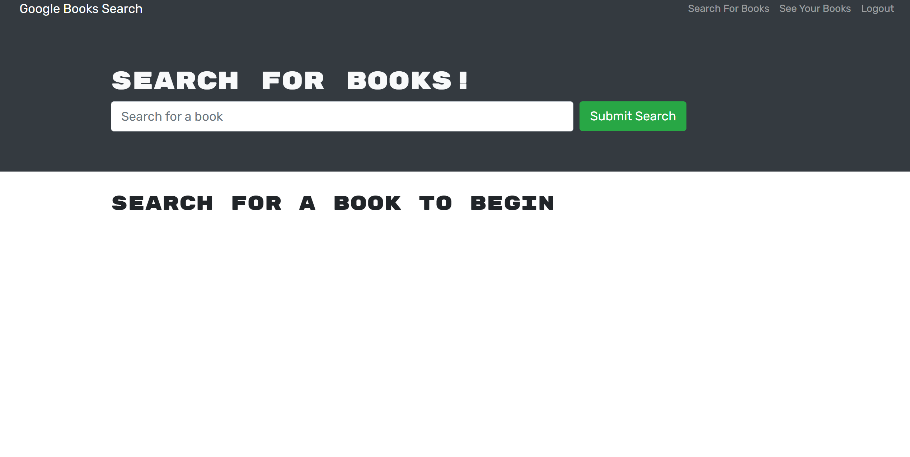
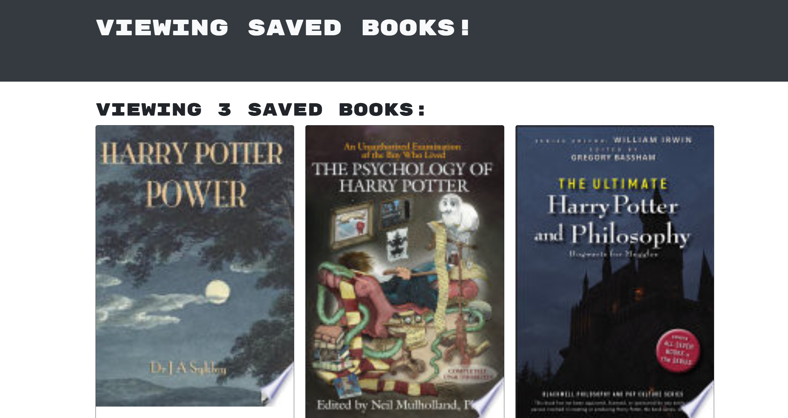

# GalacticusLibary

## Table of Contents

- [Description](#description)
- [Technology](#Technology)
- [Installation](#installation)
- [Usage](#usage)
- [License](#license)
- [Contribution](#contribution)

## Description:

This is a full-stack web application built using the MERN stack (MongoDB, Express.js, React, and Node.js) that allows users to search for books using the Google Books API and save their favorite books to their account. The application features a GraphQL API built with Apollo Server, replacing the original RESTful API. Users can sign up and log in to their account, search for books, and save or remove books from their list of favorites. The application also includes a MongoDB database hosted on MongoDB Atlas and is deployed on Heroku.

## Technology:

- MERN stack (MongoDB, Express.js, React, and Node.js)
- GraphQL API built with Apollo Server
- MongoDB Atlas for database hosting
- Heroku for deployment

## Installation

To install the application locally, follow these steps:

1. Clone the repository to your local machine
2. Install the necessary dependencies using npm install
3. Start the application using npm start

## Usage

1.Navigate to the deployed URL of the application. 2.

2. If you don't already have an account, click the "Signup" button in the top navigation and fill out the form to create an account. If you already have an account, click the "Login" button and enter your email and password.

3. Once you're logged in, you can search for books using the search bar on the homepage. Type in a search term and click the "Search" button. You'll see a list of books that match your search criteria.

4. To save a book to your list of favorites, click the "Save" button beneath the book's information. The button will change to say "Book Saved" to indicate that the book has been added to your list.

5. To view your list of saved books, click the "See Your Books" button in the top navigation. You'll see a list of all the books you've saved, with the option to remove any books from the list by clicking the "Delete" button beneath the book's information.

## Link

- https://galacticuslibary-f8e402efe1c3.herokuapp.com/

## Contact

- Kayhanturk90@Live.com
